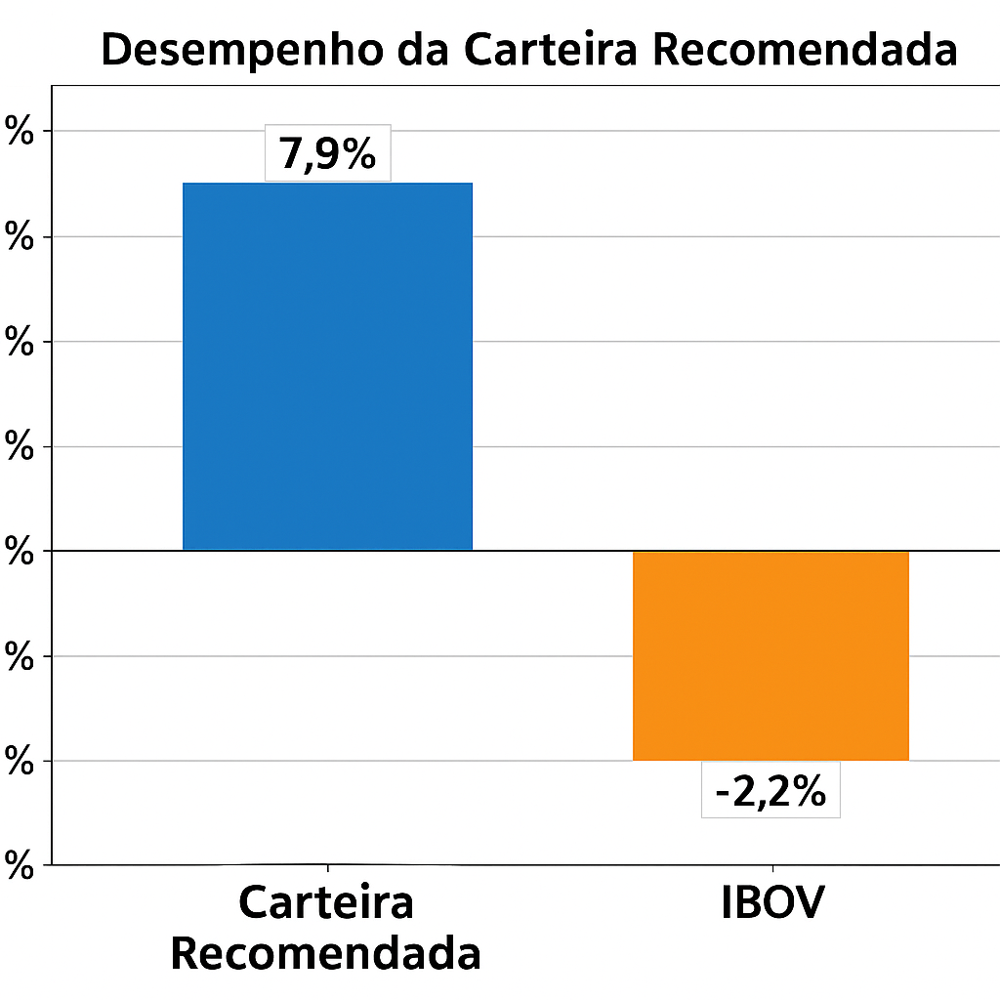

# fundamental-analysis-ml
## 📄 Descrição

Este projeto consiste na aplicação de técnicas de **Ciência de Dados** e **Machine Learning** para realizar uma **análise fundamentalista automatizada de ações**. Utilizando indicadores financeiros históricos e fundamentos das empresas, o modelo foi treinado para prever decisões de **compra** ou **venda** de ações, com foco em maximizar a rentabilidade de uma carteira.

O **objetivo principal** é demonstrar como dados fundamentalistas podem ser integrados a algoritmos de aprendizado supervisionado para automatizar processos de análise de investimentos, reduzindo subjetividade e aumentando a escalabilidade das decisões.

A **motivação** para a realização deste projeto surge da necessidade crescente no mercado financeiro por abordagens quantitativas e sistematizadas, que combinem robustez estatística, técnicas de aprendizado de máquina e eficiência na seleção de ativos, proporcionando suporte a investidores e analistas.

## ✅ Funcionalidades

- [x] Coleta e preparação de dados fundamentalistas de múltiplas empresas.
- [x] Normalização dos dados utilizando StandardScaler.
- [x] Análise de correlação para seleção das variáveis mais relevantes.
- [x] Treinamento de diversos modelos de Machine Learning:
  - Random Forest
  - AdaBoost
  - Gradient Boosting
  - Support Vector Machine (SVM)
  - Redes Neurais (MLPClassifier)
  - Outros classificadores clássicos
- [x] Avaliação dos modelos utilizando métricas como:
  - Precision
  - Recall
  - F1-Score
  - Matriz de Confusão
- [x] Otimização do modelo Random Forest utilizando GridSearchCV.
- [x] Geração de recomendações de compra ou venda de ações.
- [x] Simulação de carteira com base nas recomendações.
- [x] Comparação do desempenho da carteira recomendada com o índice IBOVESPA.
- [x] Visualização de resultados com gráficos e heatmaps.

## 💻 Tecnologias Utilizadas

- **Python 3.x** — Linguagem principal para desenvolvimento e análise.
- **Pandas** — Manipulação e análise de dados tabulares.
- **NumPy** — Operações numéricas e manipulação de arrays.
- **Scikit-learn** — Implementação de algoritmos de Machine Learning, pré-processamento, avaliação e otimização.
- **Seaborn** — Visualização estatística com gráficos mais sofisticados.
- **Matplotlib** — Criação de gráficos e visualizações.
- **Jupyter Notebook** — Ambiente interativo para desenvolvimento e documentação do projeto.

### ✅ Resultados Obtidos

Após o treinamento e ajuste do modelo, a RandomForest otimizada recomendou uma carteira de ações composta por empresas como:

- VALE3
- EMBR3
- HGTX3
- Entre outras.

Para cada ação recomendada, foi simulada a aplicação de R$ 1000, considerando a variação do preço entre 31/12/2020 e 31/03/2021.

### 💡 Interpretação dos Resultados

- **Investimento inicial total:** R$ 22.000  
- **Valor final da carteira:** R$ 23.733  
- **Retorno no período:** **+7,9%**  

No mesmo intervalo, o índice **IBOV** apresentou uma **queda de 2,2%**, evidenciando que as recomendações do modelo superaram o benchmark do mercado.

### 🔖 Descrição rápida das principais pastas

- **data/**: Armazena os datasets utilizados no projeto.
- **notebooks/**: Contém os Jupyter Notebooks com todas as etapas da análise.
- **src/**: Código modularizado para facilitar reuso e manutenção.
- **requirements.txt**: Dependências para replicar o ambiente.
- **README.md**: Documentação completa do projeto.
- **images**: Imagens usadas

## ⚠️ Aviso Legal

Este projeto foi desenvolvido exclusivamente para fins educacionais e de demonstração de técnicas de Ciência de Dados aplicadas à Análise Fundamentalista de Ações.

**Não** constitui, em hipótese alguma, recomendação de compra, venda ou manutenção de quaisquer ativos financeiros.

Os resultados apresentados são meramente ilustrativos, baseados em dados históricos, e não devem ser utilizados como base para decisões de investimento.

O autor **não se responsabiliza** por quaisquer perdas, danos ou prejuízos decorrentes do uso indevido das informações contidas neste projeto.

Consulte sempre profissionais certificados antes de tomar decisões financeiras.

## 👤 Contato

**Autor:** [Seu Nome]  

- 💼 [LinkedIn](https://www.linkedin.com/in/eduardo-augusto-da-silva-batista-vieira/)
- 💻 [GitHub](https://github.com/Eduardo1075)  
- 📧 E-mail: eduardo10vieira10@gmail.com  

Sinta-se à vontade para entrar em contato para sugestões, dúvidas ou colaborações!
